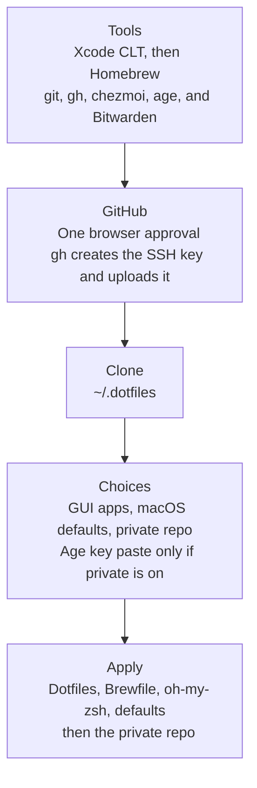

<div align="center">

# Dotfiles

**macOS, from a clean machine to a working one.**

[chezmoi](https://www.chezmoi.io/) · zsh · Homebrew · [age](https://age-encryption.org/)

<br/>

```bash
curl -fsSL alexiscreuzot.com/dots | sh
```

</div>

The checkout lands at `~/.dotfiles`. Install asks for the Mac password once, then one browser approval for GitHub (`gh` creates the SSH key and uploads it). It reads your GitHub username, name, and email, and you confirm them. The age key is one paste from Bitwarden into `~/.config/chezmoi/key.txt`, and only if you set up a private repo.

The first `chezmoi init` also asks three questions and remembers them: GUI apps, macOS defaults, and the private repo. `chezmoi init --prompt` asks again. The Brewfile, macOS defaults, and Cursor settings are the shared base. Fork the repo if you want your own.



## What gets applied

```text
dot_zshrc                 ~/.zshrc
dot_gitconfig.tmpl        ~/.gitconfig
dot_tmux.conf             ~/.tmux.conf
dot_tool-versions         ~/.tool-versions
private_dot_ssh/config    ~/.ssh/config
dot_config/gh/            ~/.config/gh/
cursor/                   Cursor settings and keybindings (symlinked)
path · aliases · functions
Brewfile                  formulae, and casks unless you skip apps
```

`dot_` becomes a dotfile, `private_` locks the file down. Apply also installs oh-my-zsh, runs `brew bundle` when the Brewfile changes, and sets macOS defaults when that script changes.

## Day to day

```bash
dots            # pull, apply, and push both repos
dots doctor     # report only
```

`dots` asks before it commits. A new skill, rule, or command is already a file in the private repo. Cursor settings live in `cursor/` here. Templates (`~/.gitconfig`, Zed settings) need a hand edit; `dots` lists the ones it cannot pull back in.

## Private

Apply looks for `<your GitHub user>/Dotfiles-private` and clones it to `~/.dotfiles-private` when it exists. No repo, or no access, and it skips. Its config lives in `~/.config/chezmoi-private/`. `dots` pulls the public repo but does not push to it unless you own that checkout.

Any chezmoi source tree works. Optional pieces: `.chezmoi.toml.tmpl` for age encryption, `dot_zshrc.private` for private shell setup, `doctor.sh` for extra checks, and an `agents/` folder with `symlink_` entries for skills. `~/.zshrc` sources `~/.zshrc.private` when it is there (`pchezmoi` is in the shared shell).

The private repo that ships with this machine holds `~/.secrets`, Zed, the Jev router, and invoices. Its `agents/` folder is symlinked into `~/.cursor` and `~/.agents`.

```bash
pchezmoi edit ~/.secrets       # decrypt, edit, re-encrypt
```

The age key is backed up in Bitwarden and never committed. Tokens (`JIRA_EMAIL`, `JIRA_TOKEN`, `JIRA_DOMAIN`, `NPM_TOKEN`, `OPENROUTER_API_KEY`) go in `~/.secrets`, not in a project `.env`. SSH keys are not in either repo. Only `~/.ssh/config` is managed.

## Shell

`fzf` is Ctrl-T (files), Ctrl-R (history), and Alt-C (directories), with `fd`, `bat`, and `eza`. `z` is zoxide. `ls`, `ll`, `la`, and `lt` go through `eza`.

| Command | Does |
| --- | --- |
| `jira get\|create\|edit` | Forum Jira. Tokens live in `~/.secrets`. |
| `xc` | Open the project in the current directory |
| `xcclean` | Delete DerivedData, after showing how much it frees |
| `sim` | Pick an iOS simulator and boot it |
| `ai` | MLX model server plus Open WebUI |
| `zed` / `sm` | Open a file in Zed |
