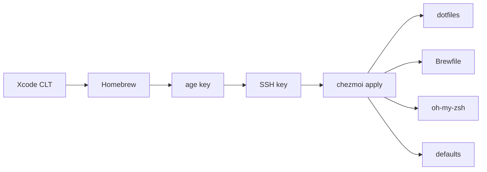

<div align="center">

# Dotfiles

**macOS, from a clean machine to a working one.**

[chezmoi](https://www.chezmoi.io/) · zsh · Homebrew · [age](https://age-encryption.org/)

<br/>

```text
git clone https://github.com/alexiscreuzot/Dotfiles.git ~/Developer/Dotfiles
~/Developer/Dotfiles/bootstrap.sh
```

</div>

A fresh Mac installs the toolchain, restores encrypted secrets, generates an SSH key, and applies every config in this repo. Restart the terminal when it finishes.

On a brand-new machine, the first `git` command prompts for **Xcode Command Line Tools** — accept, wait, then clone again.

The only manual step: bootstrap installs **Bitwarden** early, then asks you to paste the **age secret key** into `~/.config/chezmoi/key.txt`.

Once the repo is public, the same flow is a one-liner:

```bash
sh -c "$(curl -fsSL https://raw.githubusercontent.com/alexiscreuzot/Dotfiles/master/install.sh)"
```

---

## What gets applied

```text
dot_zshrc                              ~/.zshrc
dot_gitconfig                          ~/.gitconfig
dot_tmux.conf                          ~/.tmux.conf
dot_tool-versions                      ~/.tool-versions
private_dot_ssh/config                 ~/.ssh/config
encrypted_private_dot_secrets.age      ~/.secrets
dot_config/gh/                         ~/.config/gh/
dot_config/zed/                        ~/.config/zed/
private_Library/.../Cursor/            Cursor settings
private_Library/.../Code/              VS Code settings
private_Library/.../Sublime Text/      Sublime settings
path · aliases · functions             sourced from ~/.zshrc
Brewfile                               formulae, casks, extensions
```

Scripts that run as part of `chezmoi apply`:

| When | Script | Does |
| --- | --- | --- |
| Brewfile changes | `run_onchange_before_10-brew-bundle.sh.tmpl` | `brew bundle` |
| First apply | `run_once_after_20-oh-my-zsh.sh` | Install oh-my-zsh |
| Script changes | `run_onchange_after_30-macos-defaults.sh.tmpl` | Finder, Dock, keyboard, screenshots |



This directory **is** the chezmoi source. `dot_zshrc` becomes `~/.zshrc`, `dot_config/` becomes `~/.config/`, `private_` sets restrictive permissions on the target.

---

## Day to day

| | Command |
| --- | --- |
| Edit a managed file | `chezmoi edit ~/.zshrc` |
| Pull live edits back into the repo | `chezmoi re-add` |
| Preview | `chezmoi diff` |
| Apply | `chezmoi apply` |
| Start managing something new | `chezmoi add ~/.foo` |

Then commit and push — ordinary git. Brewfile and macOS-defaults changes re-run on the next `apply`.

---

## Secrets

The age private key lives at `~/.config/chezmoi/key.txt`. It is backed up in Bitwarden and never committed.

```bash
chezmoi edit ~/.secrets          # decrypt → edit → re-encrypt → apply
chezmoi add --encrypt ~/.foo     # start encrypting a new file
```

SSH **keys** are not in this repo. Bootstrap generates a fresh `id_ed25519` and prints the public key for GitHub. Only `~/.ssh/config` is managed.

---

## Notes

- Apps that were installed outside Homebrew before this setup will warn on `brew bundle`. Adopt them with `brew install --cask --force <name>` (quit the app first).
- Sublime settings are managed; Package Control itself is installed once from the Command Palette on first launch.
