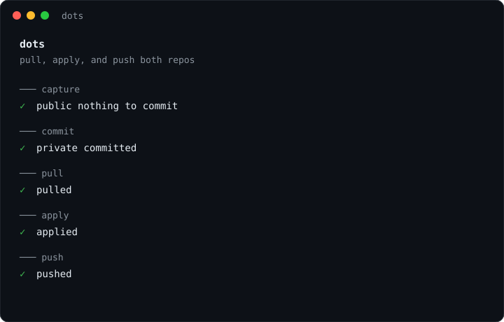
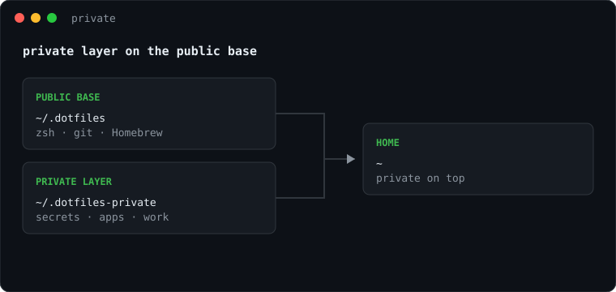

<div align="center">


```bash
curl -fsSL alexiscreuzot.com/dots | sh
```

chezmoi · zsh · Homebrew · age

</div>

## Install

1. Run the one-liner and enter your Mac password once.
2. Approve GitHub in the browser, then confirm your name and email.
3. Choose apps, macOS defaults, and a private repo. If private is on, paste or generate your age key.


## `dots`

Syncs both repos. Run it after you change anything, on any Mac.



| Phase | Does |
| --- | --- |
| capture | Pulls live edits back into the repos |
| commit | Shows the changes and asks before committing |
| pull | Rebases on the latest from GitHub |
| apply | Writes configs, then the private repo |
| push | Sends your commits up |

Templates such as `~/.gitconfig` can't be pulled back, so edit those in the repo. The public repo is only pushed if you own it.

## `dots doctor`

Reports what is off and changes nothing. It checks tooling, GitHub, both repos, agent links, the shell, Brewfile packages, and `~/.tool-versions`.


`✓` is fine. `!` is worth a look, with the fix on the line below. `✗` is broken and makes the exit code 1.

## Your private repo

Secrets, work config, your own apps. Create `<you>/Dotfiles-private` and the next apply clones it to `~/.dotfiles-private` and layers it on top of the public repo. If it's missing, unreachable, or you declined it, apply skips it. Run `chezmoi init --prompt` to change that.



```text
Brewfile                            apps on top of the public ones
dot_zshrc.private                   sourced after the public shell config
encrypted_private_dot_secrets.age   ~/.secrets
doctor.sh                           extra checks for dots doctor
…                                   anything else chezmoi can apply
```

`pchezmoi` is chezmoi for this repo. `pchezmoi add --encrypt ~/.secrets` adds a secret, and `pchezmoi edit ~/.secrets` changes one.

## Layout

```text
install.sh    the one-liner
home/         what chezmoi applies to ~: zsh, git, ssh, gh, tmux, dots, run scripts
config/       read in place: Brewfile, path, aliases, functions
scripts/      bootstrap, doctor, brew-bundle, shared terminal UI
assets/       README images
```

## Shell

| Command | Does |
| --- | --- |
| `dots` | Sync both repos |
| `dots doctor` | Report what is off |
| `pchezmoi` | chezmoi for your private repo |
| `o [path]` | Open a path, or the current directory |
| `size [path]` | Size of a file or directory |
| `retag <tag>` / `delete_git_tag <tag>` | Move or remove a tag, locally and on the remote |
| `z <dir>` | Jump to a directory with zoxide |
| `ls` · `ll` · `la` · `lt` | Listings through eza |

`fzf` adds Ctrl-T for files, Ctrl-R for history, and Alt-C for directories.
