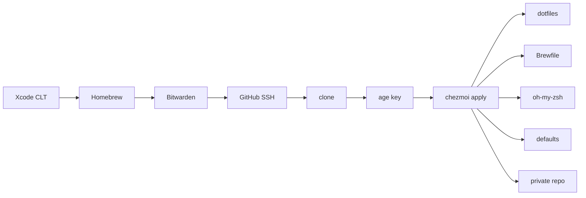

<div align="center">

# Dotfiles

**macOS, from a clean machine to a working one.**

[chezmoi](https://www.chezmoi.io/) · zsh · Homebrew · [age](https://age-encryption.org/)

<br/>

```bash
sh -c "$(curl -fsSL "https://raw.githubusercontent.com/alexiscreuzot/Dotfiles/master/install.sh?$(date +%s)")"
```

</div>

A fresh Mac installs the toolchain, signs in to GitHub over SSH, and applies every config in this repo. The checkout lives at `~/Developer/alexiscreuzot/Dotfiles`, with a symlink at `~/Developer/Dotfiles` so `~/.zshrc` and chezmoi keep a stable path. When it finishes, a login zsh starts with aliases and path already loaded.

`install.sh` installs **Bitwarden** first, then authenticates GitHub in Safari so the extension can fill the login. `gh` generates an `id_ed25519` key and uploads it. The only remaining paste is the **age secret key** into `~/.config/chezmoi/key.txt`, which the private repo uses. It asks for the **Mac password once** and reuses it for Homebrew, the oh-my-zsh ownership fix, and the login shell.

---

## What gets applied

```text
dot_zshrc                              ~/.zshrc
dot_gitconfig.tmpl                    ~/.gitconfig
dot_tmux.conf                          ~/.tmux.conf
dot_tool-versions                      ~/.tool-versions
private_dot_ssh/config                 ~/.ssh/config
dot_config/gh/                         ~/.config/gh/
cursor/                                Cursor settings and keybindings (symlinked)
path · aliases · functions             sourced from ~/.zshrc
Brewfile                               formulae, casks
```

Agent config, secrets, the Jev router, and the invoice tooling live in the private repo. See [Private](#private).

Scripts that run as part of `chezmoi apply`:

| When | Script | Does |
| --- | --- | --- |
| Brewfile changes | `run_onchange_before_10-brew-bundle.sh.tmpl` | `brew bundle` |
| First apply / script changes | `run_once_after_20-oh-my-zsh.sh` | Install oh-my-zsh and link the Spaceship theme |
| Script changes | `run_onchange_after_30-macos-defaults.sh.tmpl` | Finder, keyboard, default apps, SuperCmd, screenshots, Dock pins |
| Every apply | `run_after_90-private.sh.tmpl` | Clone and apply [Dotfiles-private](https://github.com/alexiscreuzot/Dotfiles-private) |

The first `chezmoi init` asks three questions and remembers the answers: install GUI apps, apply macOS defaults, set up the private repo. `chezmoi init --prompt` asks again.



This directory **is** the chezmoi source. `dot_zshrc` becomes `~/.zshrc`, `dot_config/` becomes `~/.config/`, `private_` sets restrictive permissions on the target.

---

## Day to day

`dots` syncs both repos: it pulls local edits back in, asks before committing, pulls, applies, and pushes.

```bash
dots            # sync
dots doctor     # same report as doctor
```

Skills, rules, and commands are symlinks into the private repo, so a new file there is already committed by the next `dots`. Cursor settings are a symlink into `cursor/` in this repo. Templates (Zed settings, `~/.gitconfig`) still need a hand edit; `dots` lists those when `re-add` cannot update them.

| | Command |
| --- | --- |
| Check the machine | `doctor` or `dots doctor` |
| One-off apply | `chezmoi apply` |
| Change the first-run choices | `chezmoi init --prompt` |

---

## Private

[Dotfiles-private](https://github.com/alexiscreuzot/Dotfiles-private) is a second chezmoi source, checked out at `~/Developer/alexiscreuzot/Dotfiles-private`. `run_after_90-private.sh` clones it on apply when it is missing, then applies it. Its config and state are `~/.config/chezmoi-private/`, so it does not share a lock with this repo. Without access to that repo, the apply warns and continues.

It holds `~/.secrets`, Zed's agent config, the Jev router, and the invoice tooling. Rules, skills, and commands live in its `agents/` folder and are symlinked into `~/.cursor` and `~/.agents`. `~/.zshrc` sources `~/.zshrc.private` from there (`pchezmoi`, the `jev-*` aliases).

`doctor` walks the toolchain, GitHub SSH, the age key, chezmoi drift, the editors and agent config, the Jev router, the login shell, the Brewfile and `~/.tool-versions`, then reports what is off. It never changes anything.

---

## Shell

`fzf` is bound to Ctrl-T (files), Ctrl-R (history) and Alt-C (directories), backed by `fd` with `bat` and `eza` previews. `zoxide` provides `z`, and autosuggestions plus syntax highlighting load last in `~/.zshrc`. `ls`, `ll`, `la` and `lt` go through `eza`.

| Command | Does |
| --- | --- |
| `jira get\|create\|edit` | ENT / Forum Jira CLI. Tokens live in `~/.secrets`, not in any repo. |
| `xc` | Open the workspace, project or package in the current directory |
| `xcclean` | Delete DerivedData, after confirming how much it frees |
| `sim` | Pick an iOS simulator with the arrow keys and boot it |
| `ai` | MLX model server plus Open WebUI, with a model picker |
| `zed` / `sm` | Open a file in Zed (`zed --wait` for git and chezmoi) |

---

## Secrets

The age private key lives at `~/.config/chezmoi/key.txt`. It is backed up in Bitwarden and never committed. Encrypted files live in the private repo. `~/.secrets` is sourced from `path`. Put tokens there (`JIRA_EMAIL`, `JIRA_TOKEN`, `JIRA_DOMAIN`, `NPM_TOKEN`, `OPENROUTER_API_KEY`) — never in a project `.env` that could be committed.

```bash
pchezmoi edit ~/.secrets          # decrypt → edit → re-encrypt → apply
pchezmoi add --encrypt ~/.foo     # start encrypting a new file
```

SSH **keys** are not in this repo. `install.sh` has `gh` generate `id_ed25519` and upload it to GitHub. Only `~/.ssh/config` is managed.

---

## Notes

- Apps already on disk (or leftover pkg receipts/helpers) are skipped by `brew bundle`. Adopt them later with `brew install --cask --force <name>` if you want Homebrew to own them.
- Zed is the default handler for Finder text files. The Homebrew cask puts `zed` on PATH.
