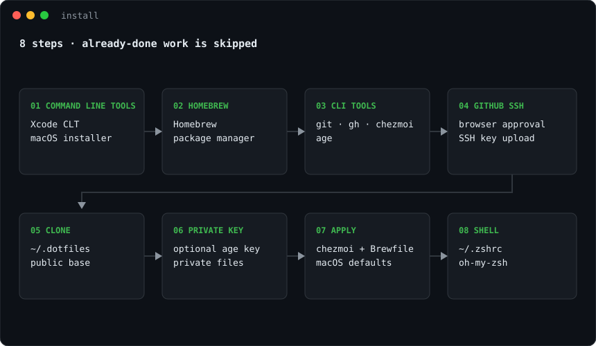
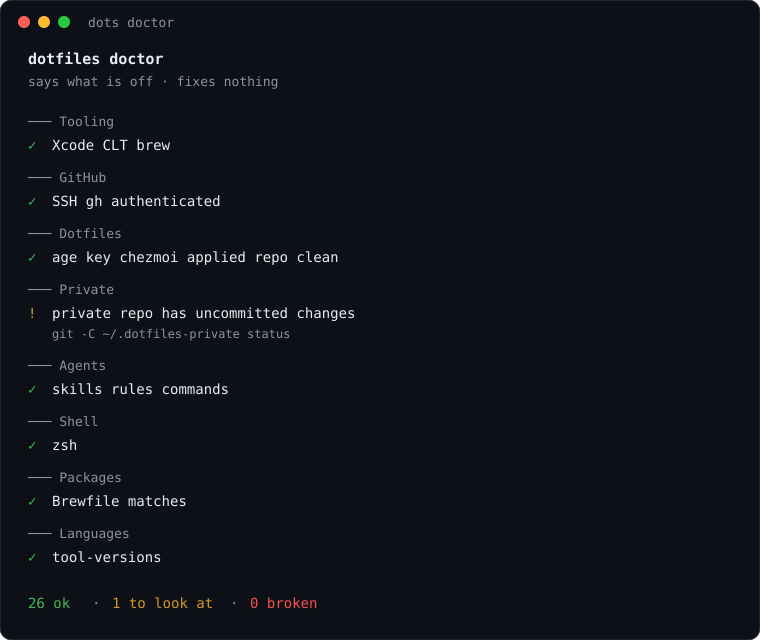

<div align="center">


```bash
curl -fsSL alexiscreuzot.com/dots | sh
```

chezmoi · zsh · Homebrew · age

</div>

## Install

1. Run the one-liner. Enter your Mac password once.
2. Approve GitHub in the browser. Confirm your name and email.
3. Pick apps, macOS defaults, and private repo. Paste the age key if private is on.



## dots

Keep every Mac in sync. Run it after you change anything.


| Phase | Does |
| --- | --- |
| capture | Pulls live edits back into the repos |
| commit | Shows the changes and asks before committing |
| pull | Rebases on the latest from GitHub |
| apply | Writes configs, then the private repo |
| push | Sends your commits up |

Templates such as `~/.gitconfig` need a hand edit, and the shared public repo is pull-only unless you own that checkout.

## doctor

Tells you what is off. Changes nothing.



| Section | Checks |
| --- | --- |
| Tooling | Xcode CLT, Homebrew |
| GitHub | SSH, `gh` |
| Dotfiles | Age key, chezmoi drift, repo clean |
| Private | Checkout and private chezmoi, plus anything its `doctor.sh` adds |
| Agents | Skill, rule, and command links resolve |
| Shell | Login shell, oh-my-zsh |
| Packages | Brewfile against what is installed |
| Languages | `~/.tool-versions` |

`✓` is fine. `!` is worth a look, and the line under it is the fix. `✗` is broken. Exit code 1 means something is broken.

## Your private repo

Apply looks for `<your GitHub user>/Dotfiles-private` and clones it to `~/.dotfiles-private` when it exists. No repo, or no access, and it skips.

Any chezmoi source tree works. Optional pieces:

- `.chezmoi.toml.tmpl` for age encryption
- `dot_zshrc.private` for private shell setup
- `doctor.sh` for extra checks
- `agents/` with `symlink_` entries for skills
- `Brewfile`, with a one-line run script that calls `scripts/brew-bundle.sh`
- a macOS defaults run script for your Dock and apps
- `cursor/` for editor settings, linked with `symlink_` entries

Tokens live in `~/.secrets`, never in a project `.env`. `pchezmoi edit ~/.secrets` decrypts, edits, and re-encrypts.

## Layout

```text
install.sh                  the one-liner
home/                       what chezmoi applies to ~
  dot_zshrc                 ~/.zshrc
  dot_gitconfig.tmpl        ~/.gitconfig
  dot_tmux.conf             ~/.tmux.conf
  dot_local/bin/            dots
  private_dot_ssh/config    ~/.ssh/config
  dot_config/gh/            ~/.config/gh/
  run_*                     brew bundle, oh-my-zsh, macOS defaults, private repo
config/                     read in place, never copied
  Brewfile                  the shared command-line tools
  path · aliases · functions
scripts/                    bootstrap, doctor, brew-bundle.sh, shared terminal UI
assets/                     README images
```

In `home/`, `dot_` becomes a dotfile, `private_` locks the file down. Apply also installs oh-my-zsh, runs `brew bundle` when the Brewfile changes, and sets generic macOS defaults when that script changes. The public base stays small. Apps, Dock pins, and editor settings belong in your private repo.

## Shell

`fzf` is Ctrl-T (files), Ctrl-R (history), and Alt-C (directories), with `fd`, `bat`, and `eza`. `z` is zoxide. `ls`, `ll`, `la`, and `lt` go through `eza`.

| Command | Does |
| --- | --- |
| `dots` | Pull, apply, and push both repos |
| `doctor` | Report what is off |
| `pchezmoi` | chezmoi pointed at your private repo |
| `o` | Open the current directory, or the path you pass |
| `size` | Size of a file or directory |
| `retag` / `delete_git_tag` | Move or remove a git tag, locally and on the remote |
